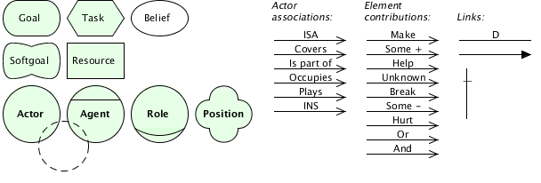

# ISTAR (i\*) Goal Modeling in UMLet 

## The palette:

Copy ISTAR.uxf to `/path/to/UMLET/palettes/` and restart [UMLet](http://umlet.com)

## Further reading

- [i* notation quick guide](http://istar.rwth-aachen.de/tiki-index.php?page=iStarQuickGuide)
- [i* publications](http://istar.rwth-aachen.de/tiki-index.php?page=Publications)
- [i* book "Social Modeling for Requirements Engineering"](http://www.cs.toronto.edu/km/istar/) or [Amazon](https://www.amazon.de/dp/0262240556)
- [i* example](https://pdfs.semanticscholar.org/949f/9eedefd5df45f45338110a35c3f2175e7c88.pdf): "Understanding business strategies of networked value constellations using goal and value modeling"
- [i* vs iStar 2.0 at a glance](https://sites.google.com/site/istarlanguage/diff)
- Tropos, Techne, Goal-oriented Requirement Language GRL (variation of i* which emphasis more the goal-oriented perspectives of 
i*), Goal Structuring Notation GSN, KAOS, Goal modeling in EEML, ...

## Feedback

Use [GitHub](https://github.com/andre-st/umlet-palettes/issues) or see [AUTHORS.md](AUTHORS.md) file

## Licence

Creative Commons BY-SA
